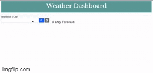

# Weather-Dashboard
This application required the use of an API key.  OpenWeather API, was what was used to create this application.  At first I attempted to do the app statically, but with a tutor decided to create the app dynamically.  This homework was quite a challenge, and had to use the knowledge of the last three assignments.

# Technology
Javascript, Jquery, CSS, HTML, Font Awesome, Google Fonts, Bootstrap, and moment js.

# Application

* City current weather is searchable by information put in the input and button pressed
* City 5 day forecast is appended when entered
* Search History appended on a list below search form.
* Search History is loaded to local storage.

# Issues
* Still haven't figured out how to make search history clickable to be presented with current and future data
* Need to figure out how to search specific city along with state.

# Application In Use

# Links
* [https://github.com/Vinyl77/Weather-Dashboard]
* [https://vinyl77.github.io/Weather-Dashboard/]

